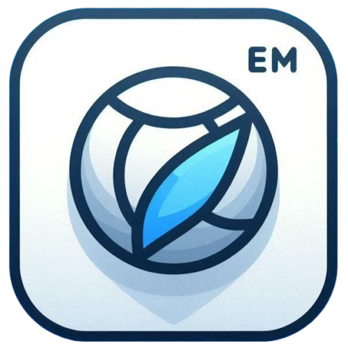

# EMWebKit


Working on a cross-language project? Want to use web technologies to create your user interfaces? Need to integrate your favorite frameworks? Want a supportive community? Look no further—**EMWebKit** is here for you!

EMWebKit is a single app that serves as a dependency for your project, allowing you to create GUI apps with any programming language. When you start the app for the first time, it will guide you based on the latest Chromium release.

## Why Choose EMWebKit for Your GUI Applications?
- In the diverse landscape of JavaScript frameworks suitable for developing GUI applications, EMWebKit emerges as a standout choice. Its cross-language nature sets it apart, offering the flexibility to integrate seamlessly with various programming languages. This feature ensures that regardless of your preferred coding language, EMWebKit adapts to your needs, providing a consistent and efficient development experience.
- Moreover, EMWebKit’s simplicity and efficiency are unmatched. It eliminates the need for numerous dependencies, requiring just a single dependency to power your entire GUI system. This approach not only streamlines the development process but also significantly lightens your application’s load, leading to a more agile and responsive user experience.


[History of EMWebKit](https://skillfulelectro.github.io/EMWebKit/Windows_Only)

## Installation Steps:
### Tested with :
- Node.js v20.14.0
- npm v10.7.0

```shell
git clone https://github.com/SkillfulElectro/EMWebKit.git
cd EMWebKit
npm install
```
to test the app before building :
```shell
npm start
```
your EMWebKit is ready to use now just
```shell
npm run dist
cd dist
```
and you will see the setup file :)

## EMWebKit: Cross-Language GUI Application Framework
EMWebKit is a powerful framework designed for creating cross-language GUI applications using web technologies. Whether you’re working with Python, Java, C++, or any other language, EMWebKit allows you to build rich graphical user interfaces (GUIs) effortlessly. Let’s dive into the details:

### Language Agnostic:
- No need to add language-specific bindings or wrappers. EMWebKit acts as a bridge between your application and the GUI layer, making it accessible from any programming language.
Use your favorite language without limitations.

### Web Technology Integration:
- Leverage the strength of web technologies (HTML, CSS, JavaScript) to create dynamic and responsive interfaces.
Tap into the vast ecosystem of web frameworks and libraries.

### GUI Application :
- to make cross-lang without needing to add language bindings , it turned out as an application which will be started as process and gets gui content from server which will be your application which hosted http server , welcome.html file will guide you : [Visit](https://skillfulelectro.github.io/EMWebKit/welcome.html)


## Upcoming features :
- extensions
- Android
- bindings with Qt
- bindings with GTK
- iOS
- Embedded (EMWebKitOS)
  

## Notes:
- this project is based on the ElectronJS , Electron-builder and Chromium . these are choosen because of simplicity and cross-platform capabilities of them
- the idea of this project was to provide a simple way to create gui applications with any language and have the power to use web tech because of their strong community and tons of frameworks availability
- for now the project does not have so much security features for keeping your html , css and js code safe because of its open source nature so if you want to use it and keep your source code safe , add authentication to the project so other people dont be able to replace the project with malicious one and and steal your ui code also compile your html , css and js file
- this project is not aiming to have strict rules for config files , they can have any names based on your use cases
- if there is any features that project is lacking of , i would be glad to you help me in making this project a perfect one but we all know nothing will be perfect

## Community Collaboration:
If you find any missing features or have ideas for improvement, join the EMWebKit community. Together, we can make this project even better!
Remember, EMWebKit is your gateway to cross-language GUI development. Explore its potential, create stunning interfaces, and build amazing applications! 🚀🌟
